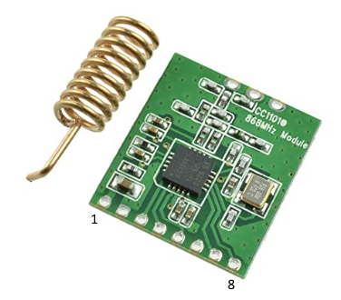
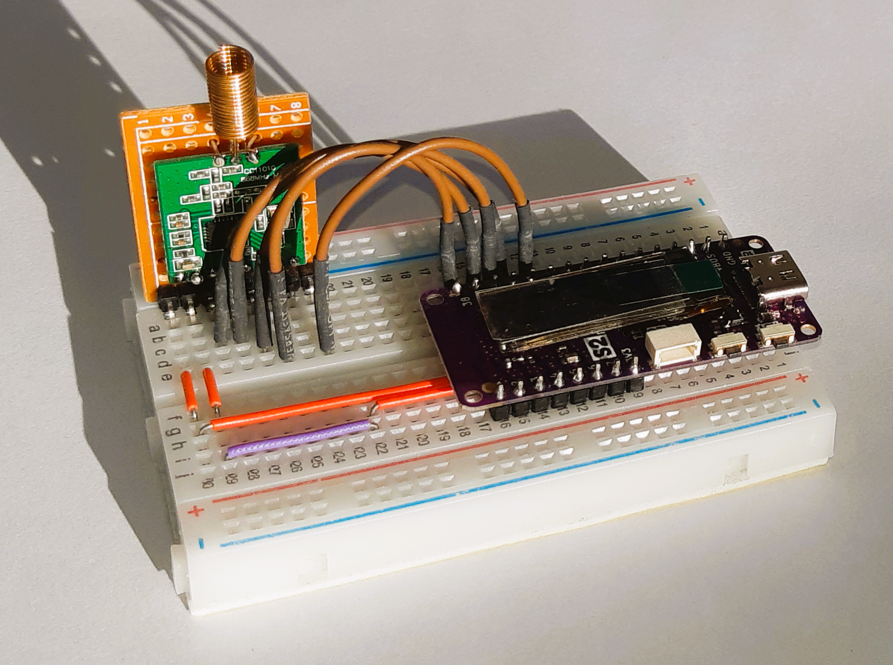
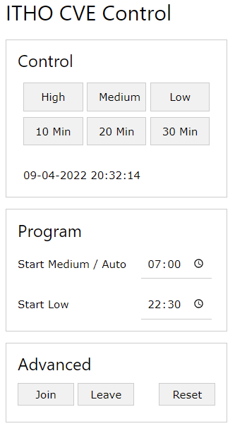

# ITHO CVU controller in MicroPython

## Problem

At home, I've got an ITHO central ventilation unit (CVU) with builtin humidity and CO2 sensor. However, these sensors only work when the CVU is set to Auto mode. In this mode the fan in principle runs at medium speed. At night this is not needed and also the fan is too noisy for me. So I wanted to be able to switch the CVU to low speed around 23:00 hrs, and return to Auto mode early in the morning.

An excellent job for a microcontroller. Many enthusiast have developed hardware and software to control an ITHO CVU. However, most code is written in C, and I use microcontrollers running MicroPython. So, I converted these C libraries into MicroPython versions. Of course that was the easy part. All credits go to the developers of these C libraries for their research in the communication protocol ITHO uses.

## Hardware

Aside from a microcontroller - for this project I'm using a [Wemos S2 Pico](https://www.wemos.cc/en/latest/s2/s2_pico.html) - the only hardware required is a [CC1101](https://www.bitsandparts.nl/RF-Transceiver-868MHz-CC1101-met-antenne-p1105676). This is a 868 MHz transceiver module which communicates with the CVU. The table below indicates how to wire these two components together.

**Pinout**

| CC1101 | Wemos S2 Pico |     |
| ------ | ------------- | --- |
| 1 VCC  | 3V3 |
| 2 GND  | GND |
| 3 MOSI | P35 |
| 4 SCK	 | P37 |
| 5 MISO | P36 |
| 6 GD02 | P38 | General IO pin, indicates CC1101 is receiving a message
| 7 GD00 | -   | Unused
| 8 SS	 | P34 | Chip select a.k.a slave select

The picture shows my actual setup using a breadboard. Note that I've made a carrier board for the CC1101 module as its pin pitch is slightly smaller than the 1.27mm used on the breadboard. Everything is powered via the USB-C cable connected to the microcontroller board.

## Software

### CC1101 driver

File *cc1101.py* contains the CC1101 driver. It is inspired by various versions written in C which can be found on GitHub. See the file header for the specific repositories I used. I tried to copy as many comments from the original libraries as possible. This version does nothing new, only difference is it is coded in MicroPython. The relevant aspects of your microcontroller and hardware design must be recorded in *config.py*. The code in the driver itself is hardware and design agnostic. The code in this repository assumes you are using the hardware as specified in the previous paragraph. By running just *cc1101.py* by itself the connection to the CC1101 module is tested. If successful output like this will appear:

    Status byte 0x3d 0b111101
    VERSION 0x14
    0x29 0x2e 0x3f
    0x29 0x2e 0x3f

### ITHO controller

The actual controller for the ITHO CVU can be found in *itho.py*. It is a MicroPython version from [letscontrolit/ESPEasyPluginPlayground](https://github.com/letscontrolit/ESPEasyPluginPlayground/tree/master/libraries%20_PLUGIN145%20ITHO%20FAN/Itho) which in turn is based on the code from [Arjen Hiemstra](https://github.com/arjenhiemstra). Functionally the controller matches the works mentioned above.
As with the driver for the CC1101 all configuration must be done in *config.py*. Initially you won't be aware of your device type and device id to use. Module *config.py* contains default values which might work for you. Just try to join (see the user-interface) with the CVU. If that does not work your device type and id can be discovered by running *itho.py* by itself and pressing the buttons on your physical ITHO RFT remote. Output such as below will appear when for example the Auto button is pressed:

    listening to remote commands

    packet 1
    device type 22
    device id 116 233 93
        command 4
        bytes 34 241 3 99 3 4
    bytes chk 34 241 3 99 3 4
        counter 83

This information can then be used to adjust *config.py*.

### Main program

The main program can be found in *controller.py*. The core function is *scheduler()* which wakes up every minute to see if commands need to be sent to the CVU. Also, as the scheduler is dependent on the correct time, and I am not sure what the accuracy of the ESP32S2's internal clock is, once per 24 hrs this clock is synchronized with a ntp server (see *ntp.py*).

A small web user-interface is included based on [ahttpserver](https://github.com/erikdelange/MicroPython-HTTP-Server). This can be used to manually control the CVU but also to set the times when the CVU must be switched to low speed and when back to medium/auto speed. The default run times for the tasks are hardcoded in dict *tasks*. If you deviate from these times they are saved in file *tasks.json* which if present supersedes the default values.

The main program is based on asyncio which makes it easy to execute multiple tasks concurrently such as running the scheduler, an HTTP server and checking the state of the user-button.

The three panels on the UI are collapsable (accordions). The bottom one is normally collapsed.

For debug purposes the webserver can be stopped by calling *IP address of your microcontroller*:80/api/stop or by pressing the user button on the microcontroller board. Constant BUTTON in *config.py* defines the pin number connected to the button.

Debugging is also the reason why the code in *controller.py* is not included in *main.py* (making *controller.py* superfluous). During development *main.py* is set up in such a way that the controller is not started automatically after reset or power-up. I'm using my IDE (Thonny) to connect to the Wemos board to get a repl prompt. From this prompt I start the controller by *import controller*. In that way error or debugging messages are captured by the shell.

### Additional modules needed

Also copy [ahttpserver](https://github.com/erikdelange/MicroPython-HTTP-Server), [uftpd.py](https://github.com/robert-hh/FTP-Server-for-ESP8266-ESP32-and-PYBD/blob/master/uftpd.py) and [abutton.py](https://github.com/kevinkk525/pysmartnode/blob/master/pysmartnode/utils/abutton.py) to your microcontroller. The code of these modules is not included in this repository. Strictly speaking *uftpd.py* is not necessary, however I find it handy to be able to move files to the microcontroller using the FileZilla FTP client, especially when the board is not close to my PC and not connected via a cable.

### Additional information

[CC1101 Datasheet](https://www.ti.com/lit/ds/symlink/cc1101.pdf)

[DN503 - SPI Access (for the CC1101)](https://www.ti.com/lit/an/swra112b/swra112b.pdf)